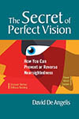

PDF version of Book __The Secret of Perfect Vision: How You Can Prevent or Reverse Nearsightedness__ by __David De Angelis__    
 Author David De Angelis’s search for a cure for nearsightedness was both professional and personal, since he suffered from the disease himself. An expert in muscular work dynamics, he discovered through extensive testing and an immersion in decades of scientific studies that working the extrinsic ocular muscles could preserve sight and reeducate the eyes toward better vision. He came to understand the importance of retinal defocus for transforming ocular refractive status.  
 In this book, the author shares both the science and the "secret" progressive retinal defocus technique of how he was able to reverse his own myopia. The system’s efficacy, he says, comes from the fact that it directly intervenes with the causes that generate myopia onset and development (overaccommodative/near-point stress). When adequately stimulated by the simple exercises presented in the book, ocular refractive capability leads to gradual strengthening of focusing capability and gradual decreasing of refractive error. Written in straightforward language, and featuring an extensive section on the scientific research in this field, The Secret of Perfect Vision offers a proven program of healing to the millions of people afflicted with this condition.

[
Download PDF
](Secret of Perfect Vision - David De Angelis.pdf)    
